# Trackademia 👩‍🎓👨‍🎓

Trackademia is a mobile application for managing student records with a user-friendly and intuitive interface. It performs CRUD operations for managing student information,
and has a backend integration with a PHP API and MySQL database. This project served as a final requirement for the PDC50 course (BSIT, Year 4) at Angeles University Foundation. 

## Student Records Application
### Source Code
#### Model
- [AcademicHistory.cs](Trackademia/Model/AcademicHistory.cs)
- [AcademicProgram.cs](Trackademia/Model/AcademicProgram.cs)
- [Attendance.cs](Trackademia/Model/Attendance.cs)
- [User.cs](Trackademia/Model/User.cs)
#### ViewModel
- [AcademicHistoryViewModel.cs](Trackademia/ViewModel/AcademicHistoryViewModel.cs)
- [AttendanceViewModel.cs](Trackademia/ViewModel/AttendanceViewModel.cs)
- [DashboardViewModel.cs](Trackademia/ViewModel/DashboardViewModel.cs)
- [StudentDetailsViewModel.cs](Trackademia/ViewModel/StudentDetailsViewModel.cs)
- [UserViewModel.cs](Trackademia/ViewModel/UserViewModel.cs)
#### ViewModel
- [AcademicHistoryViewModel.cs](Trackademia/ViewModel/AcademicHistoryViewModel.cs)
- [AttendanceViewModel.cs](Trackademia/ViewModel/AttendanceViewModel.cs)
- [DashboardViewModel.cs](Trackademia/ViewModel/DashboardViewModel.cs)
- [StudentDetailsViewModel.cs](Trackademia/ViewModel/StudentDetailsViewModel.cs)
- [UserViewModel.cs](Trackademia/ViewModel/UserViewModel.cs)
#### View
- [AcademicHistoryPage.xaml](Trackademia/View/AcademicHistoryPage.xaml)
- [AttendancePage.xaml](Trackademia/View/AttendancePage.xaml)
- [Dashboard.xaml](Trackademia/View/Dashboard.xaml)
- [LoginPage.xaml](Trackademia/View/LoginPage.xaml)
- [StudentDetailsPage.xaml](Trackademia/View/StudentDetailsPage.xaml)
- [StudentInformationPage.xaml](Trackademia/View/StudentInformationPage.xaml)
- [UserPage.xaml](Trackademia/View/UserPage.xaml)

## Features and Functionalities
### LoginPage
#### Output Screenshots

    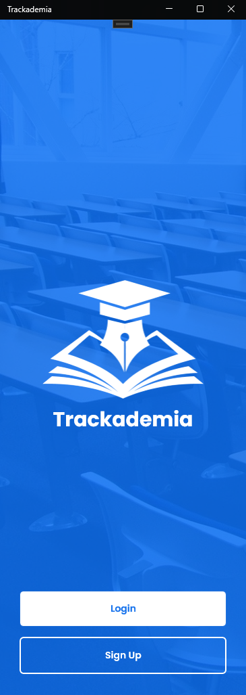
    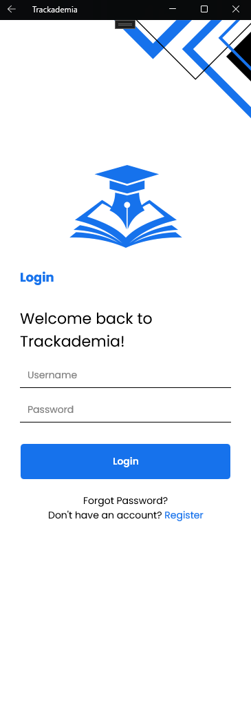

### Dashboard
#### Output Screenshots

    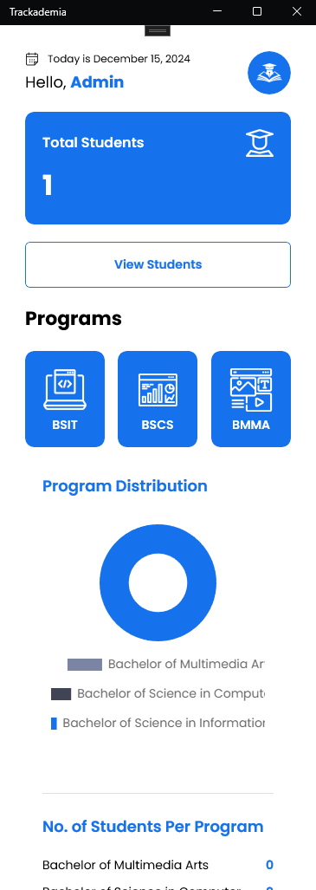
    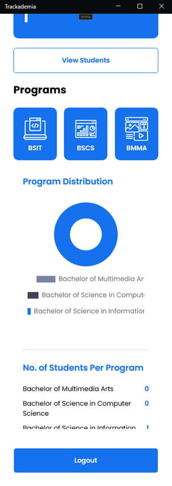

### Student List with Filter and CRUD
#### Output Screenshots

    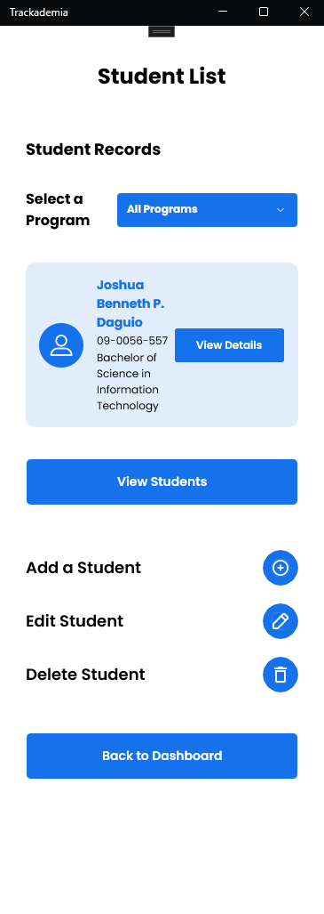
    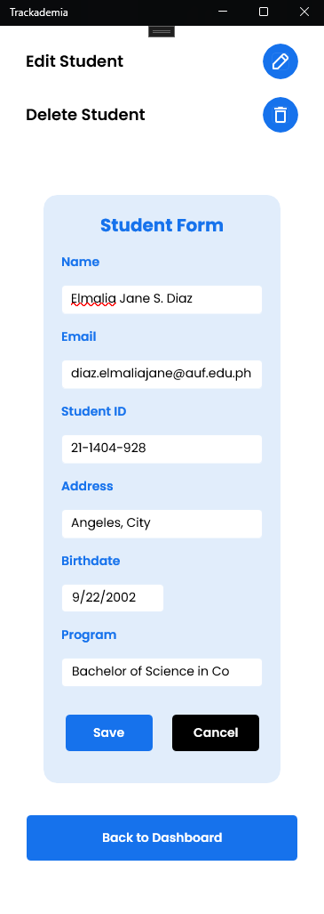

    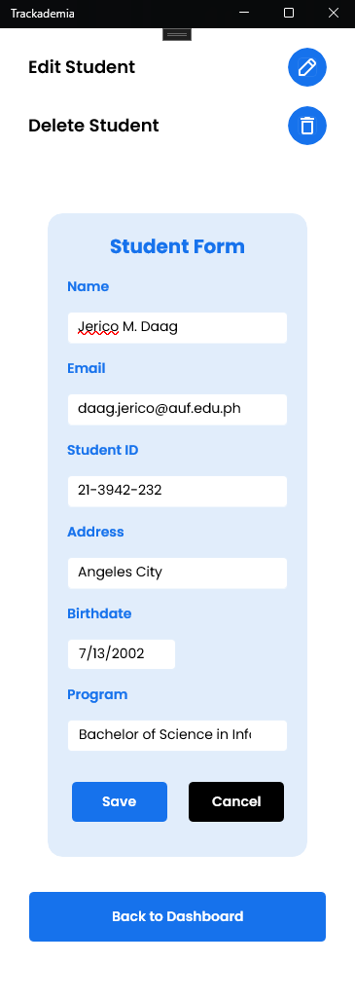
    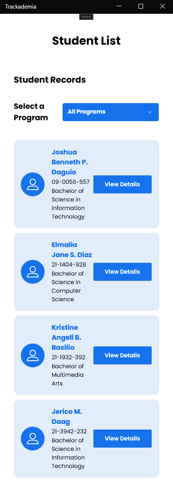

### Student Details (Personal Information, Academic History, and Attendance Records)
#### Output Screenshots

    
    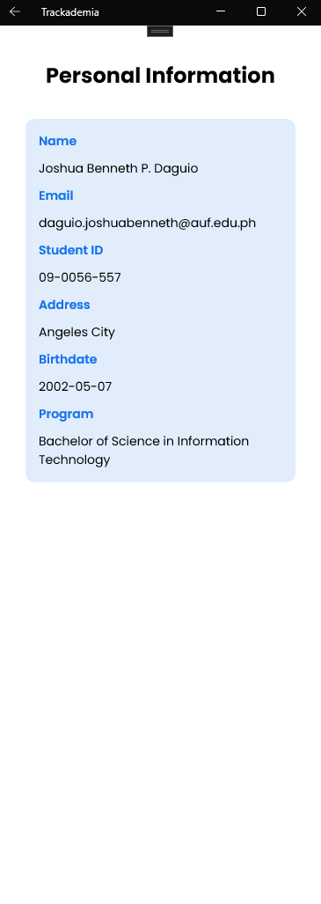

    
    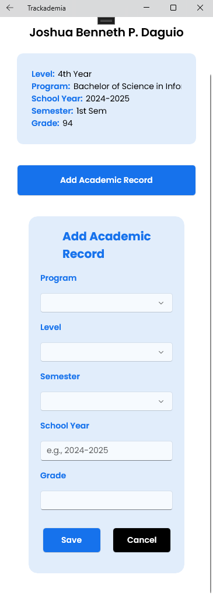

    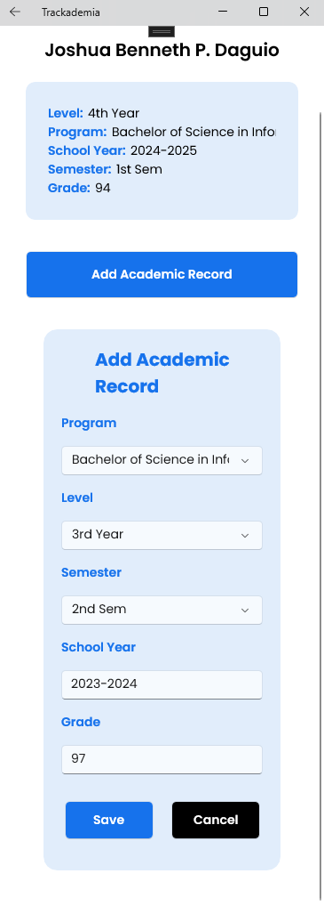
    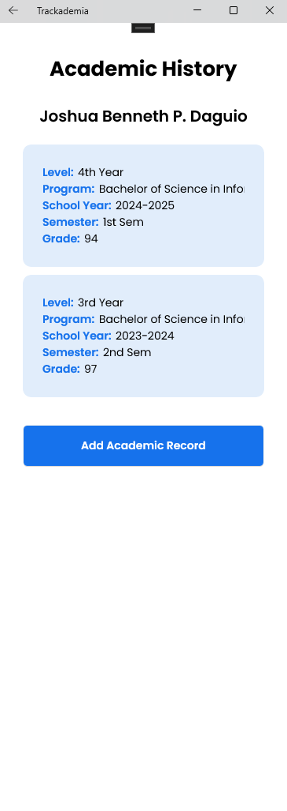

    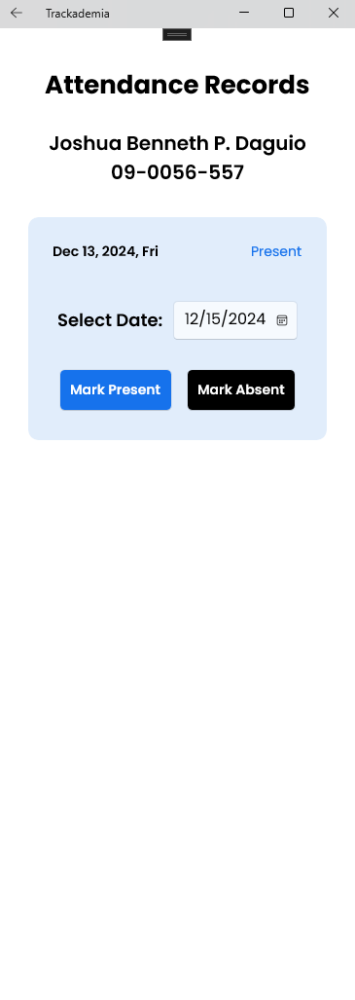
    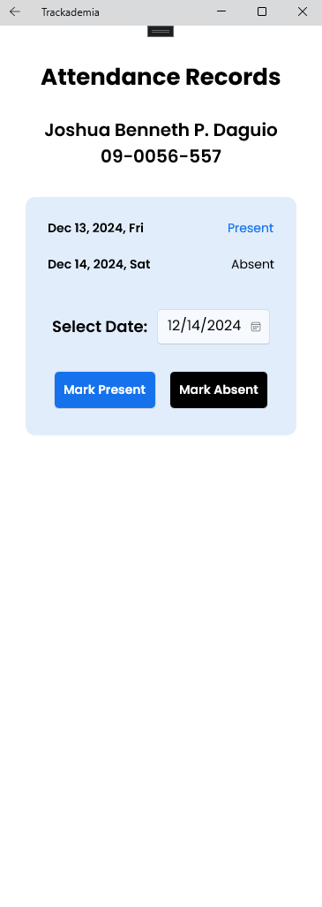

## Technical Stack
    - .NET MAUI
    - C#
    - PHP
    - MySQL
    - XAML
    - Entity Framework Core
    - Git
    - Visual Studio

## Collaborators
- Joshua Benneth P. Daguio
- Elmalia Jane S. Diaz
- Kristine Angeli B. Basilio
- Jerico M. Daag